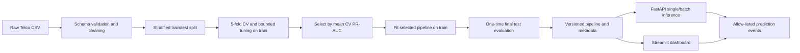

# Production-Oriented Telecom Customer Churn Prediction & Retention Analytics

An end-to-end portfolio project for identifying telecom customers whose historical account patterns are associated with churn. It includes data validation, leakage-safe model selection, FastAPI inference, a Streamlit dashboard, batch scoring, explanations, and Docker Compose orchestration. It is a reproducible demonstration, **not a production-certified service**.

## Demo video

[▶ Play the project demo](video/demo.mp4)

The video is encoded for browser playback and kept under GitHub's 10 MB preview limit.

## Business problem

Retention teams have limited time for outreach. A churn score can help rank customers for review; it does not prove that an individual will leave or that an offer will change their behavior. This project demonstrates ranking, operating-point trade-offs, and estimated monthly revenue exposure using a public historical dataset.

## Capabilities

- Pandera schema validation and conservative data cleaning
- Stratified train/test split before fitted transforms
- Stratified five-fold CV and bounded randomized tuning for Logistic Regression, Random Forest, and XGBoost
- Class-weighted imbalance handling; no vanilla SMOTE on one-hot categories
- Accuracy, precision, recall, F1, ROC-AUC, PR-AUC, Brier score, confusion matrices, PR/ROC and calibration plots
- OOF threshold trade-off analysis and held-out Top-K/lift reports
- Dataset hash, model/feature versions, CV results, parameters, and test metrics in JSON metadata
- SHAP global summary and per-customer feature contributions
- FastAPI single and batch inference endpoints
- Streamlit overview, historical churn charts, risk distribution, what-if scores, explanations, retention suggestions, and CSV batch upload/export
- Allow-listed prediction logs and heuristic PSI data-drift summaries
- Docker training bootstrap separated from API/dashboard runtime images
- Tests, lint/format checks, coverage output, and CI image smoke check

## Dataset

Use the IBM Telco Customer Churn CSV with 7,043 rows and 21 source columns. Place it at `data/telco_churn.csv`; CSV datasets are intentionally ignored by Git and are not committed. The target `Churn` is encoded as 1 for Yes and 0 for No. `customerID` is retained only as an optional output key and is excluded from model features.

Missing `TotalCharges` values are preserved as missing and imputed within the fitted numeric pipeline. The model derives `tenure_group`, `service_count`, and `average_monthly_spend` from each individual row. This public historical dataset may not represent current products, pricing, or customers.

## Architecture and data flow



The split is performed on raw customer rows. Feature construction is row-local. Numeric imputation/scaling and categorical imputation/one-hot encoding are fitted inside each CV training fold and then the final training partition. The test set is not used for search, candidate selection, or threshold selection.

## Imbalance, selection, and metrics

The former vanilla SMOTE-after-one-hot approach was removed. Interpolating one-hot indicators can make fractional, invalid categories. Logistic Regression and Random Forest use class weights; XGBoost uses `scale_pos_weight` calculated from the training partition. This compares established estimators without fabricating category combinations. No method is presented as universally optimal.

Each estimator receives a small, seeded `RandomizedSearchCV` with stratified five-fold CV. Mean average precision (PR-AUC) selects the model because it summarizes precision/recall ranking under churn-class imbalance. ROC-AUC, accuracy, precision, recall, F1, PR-AUC, and Brier score are reported. A precision-recall curve is included alongside ROC and confusion-matrix plots.

The calibration curve and Brier score assess probability quality; they do not guarantee calibrated future probabilities. A calibrated wrapper is not applied automatically: compare its held-out calibration behavior before adopting one. See `reports/model_results.csv`, `reports/figures/`, and `models/model_metadata.json` after training.

The selected XGBoost scored mean CV PR-AUC 0.6658 (standard deviation 0.0227). Random Forest scored 0.6652 (standard deviation 0.0193), so the CV scores are close and do not establish a statistically clear winner.

| Model | Test accuracy | Precision | Recall | F1 | ROC-AUC | PR-AUC | Brier |
| --- | ---: | ---: | ---: | ---: | ---: | ---: | ---: |
| XGBoost (selected by CV PR-AUC) | 0.7559 | 0.5275 | 0.7701 | 0.6261 | 0.8428 | 0.6513 | 0.1595 |
| Random Forest | 0.7622 | 0.5366 | 0.7647 | 0.6307 | 0.8442 | 0.6515 | 0.1577 |
| Logistic Regression | 0.7317 | 0.4966 | 0.7861 | 0.6087 | 0.8416 | 0.6337 | 0.1672 |

## Threshold, Top-K, and revenue exposure

Threshold reports at 0.30–0.70 (and the configured threshold) use out-of-fold predictions from training data. The configured default remains 0.50 because no contact cost, offer cost, or customer lifetime value was supplied. It is an operating point, not an optimized business threshold. Set `CHURN_THRESHOLD` in `.env` after the business chooses a cost-based policy.

Top 5%, 10%, 20%, and 30% targeting results are evaluated on the untouched test set and report outreach volume, churners captured, precision, recall, and lift. These answer ranking-capacity questions, not guaranteed campaign results.

Revenue exposure is calculated as `MonthlyCharges × predicted churn probability`. It is an estimated model-based exposure, **not causal financial loss, avoided revenue, or savings**. The dashboard labels this assumption next to the displayed amount.

## Explainability and recommendations

SHAP values use the fitted estimator in its transformed feature space; encoded category names are mapped back to source fields. Training writes a global SHAP summary and importance CSV. Individual predictions show positive and negative model-output contributors. Rule-based retention suggestions use fields such as contract, tenure, support subscription, and relative charges. These are descriptive, not causal.

The dashboard supports a contract what-if score by changing one model input and re-scoring the customer. It is model-based scenario analysis, not the causal impact of a contract change.

The dashboard is organized into sidebar workspaces: **Overview**, **Customer Analysis**, **Churn Analysis**, **Revenue Analysis**, **Prediction**, **Model Performance**, **Explainability**, **Retention Insights**, and **Monitoring & Batch Scoring**. Analytics show the complete source dataset. The prediction form retains its existing model inputs and SHAP explanation workflow. The dark theme, cards, plots, and tables adapt to narrower screens; charts remain interactive with point-level hover details.

## Install and run locally

Python 3.10+ is supported. On Windows PowerShell, from the repository root:

```powershell
python -m venv .venv
.\.venv\Scripts\Activate.ps1
python -m pip install -r requirements.txt
python -m pip install -r requirements-dev.txt
```

Place the source CSV at `data/telco_churn.csv`, then train:

```powershell
python -m src.train
```

Start the dashboard and API in separate terminals:

```powershell
python -m streamlit run app.py
python -m uvicorn api.main:app --reload --host 127.0.0.1 --port 8000
```

Dashboard: `http://localhost:8501`. API docs: `http://127.0.0.1:8000/docs`.

Copy `.env.example` to `.env` to configure local data/model/report paths, versions, split seed, risk bands, and the decision threshold. `.env` is ignored by Git. The checked-in example contains no credentials.

## API

- `GET /health`
- `GET /model-info`
- `POST /predict`
- `POST /predict/batch` (1–1,000 customers per request)

The existing single-customer endpoint remains available. API fields use snake_case, e.g. `monthly_charges`. Omitted fields receive documented defaults. The batch body is `{"customers": [{"customer_id": "optional-key", "tenure": 12}]}`; each customer is validated and only the optional key, prediction, churn probability, risk level, and model version are returned. CSV upload expects all raw model input fields; `customerID` is optional and `Churn`, if present, is ignored. Batch output omits the input feature payload.

## Docker

Docker Compose runs a one-shot `model-bootstrap` service, then API and dashboard. Bootstrap trains only when the persistent model volume is empty or contains a stale version; it does not train during every API/dashboard start. Ensure the CSV is at `data/telco_churn.csv` before first compose run:

```powershell
docker compose up --build
```

Open `http://localhost:8501` for Streamlit and `http://localhost:8000/docs` for the API. To force retraining:

```powershell
docker compose run --rm --no-deps model-bootstrap python -m src.bootstrap --force
```

`docker compose down` keeps model/log volumes; `docker compose down -v` removes them.

## Monitoring

Prediction logs store timestamp, model version, score, prediction, risk, and allow-listed account/service fields. They omit identifiers, demographics, and the full request. Summary cards report prediction volume and scores only. With at least 30 events, the dashboard shows PSI comparisons against the supplied dataset. PSI cut-offs are heuristic review flags, not proof of drift impact. No post-prediction outcomes are collected, so true production precision/recall, calibration, and performance monitoring are unavailable.

## Tests and quality checks

```powershell
python -m pytest -q --cov=src --cov=api --cov-report=term-missing
ruff check .
black --check .
isort --check-only .
```

GitHub Actions runs lint, formatting, tests with coverage, builds the inference image, and smoke-tests its API import.

## Limitations and next steps

- Public historical data is not a substitute for current representative production data.
- Threshold choice needs verified outreach costs and business constraints.
- Revenue exposure is a score-weighted descriptive estimate, not expected causal loss.
- No observed outcomes are available for performance monitoring.
- SHAP and scenario comparisons explain model behavior, not causal drivers.
- Authentication, authorization, rate limiting, registry, secrets management, and load testing are not implemented; do not expose this demo publicly as-is.

Reasonable next steps are prospective outcome collection, cost-based threshold evaluation, calibration comparison, authenticated deployment, and drift/performance review using observed labels.

## Repository map

```text
api/                  FastAPI request schemas and routes
src/                  Cleaning, validation, features, CV training, inference, monitoring
tests/                Unit and contract tests using synthetic rows
data/                 Local source CSV (ignored by Git)
models/               Local model metadata and generated artifacts
reports/              Metrics, business analyses, and plots
notebooks/             Exploratory data analysis notebook
app.py                 Streamlit dashboard
config.py              Environment-aware configuration
docker-compose.yml      Bootstrap, API, dashboard, and persistent volumes
Dockerfile              Separate training/runtime targets
```

## License

License selection is pending project-owner choice. No license grant is made until one is selected.
